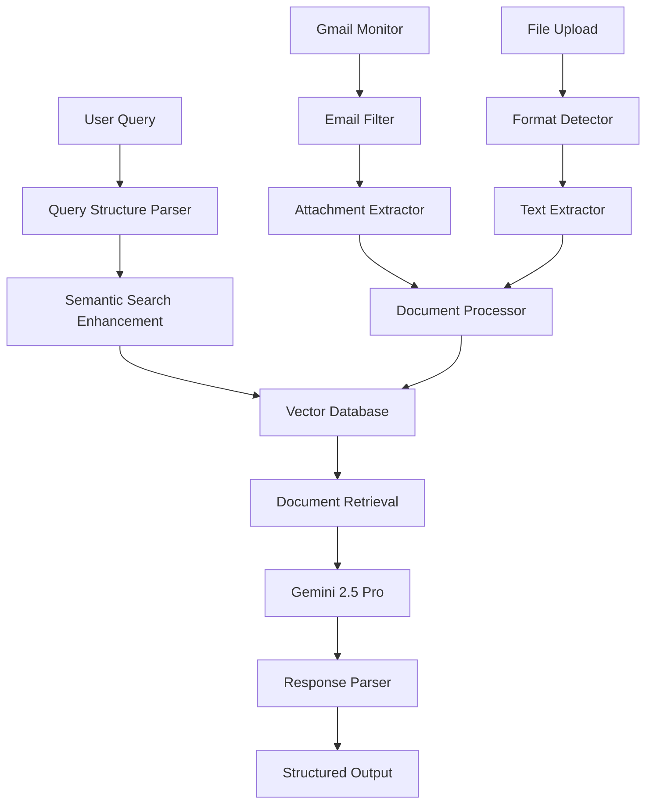

# 🏥 Bajaj Finserv Hackathon - AI-Powered Insurance Claims Assistant

[](https://python.org)
[](https://streamlit.io)
[](https://cloud.google.com/vertex-ai)
[](LICENSE)

An intelligent insurance claims processing system that leverages **Google Vertex AI**, **RAG (Retrieval Augmented Generation)**, and **Gmail integration** to automate insurance claim evaluation and provide instant, accurate responses to policy-related queries.

## 🌟 Features

### 🤖 **AI-Powered Claims Processing**
- **Automated Claim Evaluation**: Uses Google Gemini 2.5 Pro for intelligent claim analysis
- **Structured Query Parsing**: Extracts age, gender, procedures, locations, and amounts from natural language
- **Confidence Scoring**: Provides high/medium/low confidence ratings for all decisions
- **Multi-format Support**: Processes PDF, DOCX, and email attachments

### 📧 **Gmail Integration**
- **Smart Email Filtering**: Automatically identifies insurance-related emails
- **Attachment Processing**: Downloads and processes policy documents from emails
- **Real-time Monitoring**: Continuously monitors for new insurance communications
- **Keyword-based Filtering**: Intelligently filters relevant emails using predefined keywords

### 🔍 **Semantic Search & RAG**
- **Vector Database**: FAISS-powered semantic search for policy documents
- **Enhanced Retrieval**: Multi-query search with semantic enhancement
- **Document Chunking**: Intelligent text segmentation for better context retrieval
- **Embedding Models**: Uses `intfloat/e5-base-v2` for high-quality embeddings

### 🎯 **Intelligent Decision Making**
- **Policy Analysis**: Comprehensive evaluation against policy terms and conditions
- **Exclusion Checking**: Automatically checks for policy exclusions and waiting periods
- **Justification Tracking**: Provides detailed reasoning with source citations
- **Amount Calculation**: Calculates eligible claim amounts when applicable

## 🏗️ Architecture



## 📦 Installation

### Prerequisites
- Python 3.12+
- Google Cloud Account with Vertex AI enabled
- Gmail API credentials
- Git

### 1. Clone the Repository
```bash
git clone https://github.com/Aayush-K15/Bajaj-Finserv-Hackathon.git
cd Bajaj-Finserv-Hackathon
```

### 2. Create Virtual Environment
```bash
python -m venv venv-vertex
source venv-vertex/bin/activate  # On Windows: venv-vertex\Scripts\activate
```

### 3. Install Dependencies
```bash
pip install -r requirements.txt
```

### 4. Configure Environment
Create a `.env` file in the root directory:
```env
# Project Configuration
PROJECT_NAME=bajaj-finserv-hackathon
PROJECT_ID=468017
COMPANY_NAME=bajaj-finserv

# Google Cloud Configuration
GCP_PROJECT_ID=bajaj-finserv-hackathon-468017
SERVICE_ACCOUNT_FILE=bajaj-finserv-hackathon-468017-5c524f36fc39.json
CREDENTIALS_FILE=credentials.json

# Authentication Files
TOKEN_FILE=bajaj-finserv_CSA_token.pickle
DEFAULT_TOKEN_FILE=default_token.pickle

# Application Directories
EMAIL_ATTACHMENTS_DIR=email_attachments
UPLOADED_DOCS_DIR=uploaded_docs
VECTORSTORE_DIR=vectorstore
EMBEDDINGS_DIR=embeddings

# Virtual Environment
VENV_DIR=venv-vertex
```

### 5. Set Up Google Cloud Credentials

#### Gmail API Setup:
1. Go to [Google Cloud Console](https://console.cloud.google.com/)
2. Create a new project or select existing one
3. Enable Gmail API
4. Create credentials (OAuth 2.0 Client ID)
5. Download `credentials.json` and place in root directory

#### Vertex AI Setup:
1. Enable Vertex AI API in Google Cloud Console
2. Create a service account with Vertex AI permissions
3. Download the service account key as `bajaj-finserv-hackathon-468017-5c524f36fc39.json`
4. Place the file in the root directory

## 🚀 Usage

### Starting the Application
```bash
streamlit run app.py
```

The application will be available at `http://localhost:8501`

### 📱 **Web Interface Features**

#### 1. **Document Upload & Processing**
- Upload PDF or DOCX policy documents
- Automatic text extraction and indexing
- Real-time processing feedback

#### 2. **Gmail Integration**
- Authenticate with your Gmail account
- Automatic email scanning for insurance documents
- One-click processing of email attachments

#### 3. **Query Processing**
- Natural language query input
- Instant AI-powered responses
- Detailed justification with source citations

### 💬 **Query Examples**

```text
"46M, knee surgery, Pune, 3-month policy"
→ Analyzes coverage for 46-year-old male requiring knee surgery

"Is cardiac bypass surgery covered for ₹5 lakhs?"
→ Evaluates coverage limits and eligibility

"Pre-existing diabetes treatment after 18 months"
→ Checks waiting period compliance
```

## 🔧 Technical Components

### Core Modules

#### **📄 Document Loaders** (`/loaders/`)
- **`pdf_loader.py`**: Advanced PDF text extraction with metadata preservation
- **`docx_loader.py`**: Microsoft Word document processing
- **`emailloader.py`**: Email content and attachment handler

#### **🧠 Embeddings** (`/embeddings/`)
- **`embedder.py`**: Text chunking and embedding generation
- **Model**: `intfloat/e5-base-v2` for semantic understanding
- **Chunking**: Intelligent 15,000-word chunks with overlap

#### **🔍 RAG System** (`/rag/`)
- **`query_engine.py`**: Core query processing and response generation
- **Features**:
  - Structured query parsing (age, gender, procedure extraction)
  - Enhanced semantic search
  - Robust JSON response parsing
  - Confidence scoring

#### **💾 Vector Store** (`/vectorstore/`)
- **`store.py`**: FAISS-based vector database management
- **Features**:
  - Efficient similarity search
  - Persistent storage
  - Metadata tracking

#### **📧 Gmail Integration** (`gmail_reader.py`)
- **Features**:
  - OAuth 2.0 authentication
  - Smart email filtering
  - Attachment downloading
  - Keyword-based relevance scoring

### 🛠️ **Advanced Features**

#### **Query Structure Parsing**
Automatically extracts:
- **Age**: "46M", "32F", "25 years old"
- **Gender**: Male/Female identification
- **Procedures**: Surgery types, treatments
- **Location**: City/state extraction
- **Policy Duration**: "3-month policy", "2-year coverage"
- **Amounts**: "₹50,000", "Rs. 2 lakhs"

#### **Enhanced Search**
- **Multi-query approach**: Original + enhanced queries
- **Medical term expansion**: "knee" → "orthopedic", "joint replacement"
- **Age-specific terms**: "60+" → "senior citizen", "elderly"
- **Context enrichment**: Automatic addition of insurance terms

#### **Robust JSON Parsing**
- **Truncation handling**: Completes incomplete JSON responses
- **Format cleaning**: Removes markdown, fixes trailing commas
- **Fallback parsing**: Graceful degradation on parse failures
- **Error recovery**: Intelligent reconstruction of malformed responses

## 📊 Response Format

The system provides structured responses with:

```json
{
  "direct_answer": "Yes, knee surgery is covered under the policy.",
  "decision": "Approved|Rejected|Partial|Information",
  "amount": "₹50,000",
  "confidence": "High|Medium|Low",
  "summary": "Brief explanation of the decision",
  "justification": [
    {
      "clause": "Exact policy text supporting the decision",
      "source": "document.pdf",
      "page": 14,
      "relevance": "How this applies to the query"
    }
  ],
  "additional_requirements": ["Required documents or steps"],
  "exclusions_checked": ["Exclusions that were evaluated"],
  "_metadata": {
    "structured_query": "Parsed query components",
    "enhanced_search": true,
    "chunks_used": 8
  }
}
```

## 🔒 Security & Privacy

- **OAuth 2.0**: Secure Gmail authentication
- **Local Processing**: Documents processed locally
- **API Security**: Google Cloud service account authentication
- **Data Isolation**: User data kept separate and secure

## 🤝 Contributing

1. **Fork the repository**
2. **Create a feature branch** (`git checkout -b feature/AmazingFeature`)
3. **Commit changes** (`git commit -m 'Add AmazingFeature'`)
4. **Push to branch** (`git push origin feature/AmazingFeature`)
5. **Open a Pull Request**

### Development Setup
```bash
# Install development dependencies
pip install -r requirements-dev.txt

# Run tests
python -m pytest tests/

# Code formatting
black .
flake8 .
```

## 📋 Project Structure

```
bajaj-finserv-hackathon/
├── 📱 app.py                          # Main Streamlit application
├── 📧 gmail_reader.py                 # Gmail API integration
├── ⚙️ test_env.py                     # Environment testing
├── 📄 requirements.txt                # Python dependencies
├── 🔐 credentials.json                # Gmail API credentials
├── 🔑 bajaj-finserv-hackathon-*.json  # GCP service account key
├── 🎯 .env                           # Environment variables
│
├── 📂 loaders/                        # Document processing
│   ├── pdf_loader.py                 # PDF text extraction
│   ├── docx_loader.py                # Word document processing
│   └── emailloader.py                # Email content handler
│
├── 🧠 embeddings/                     # Text embedding system
│   └── embedder.py                   # Text chunking & embedding
│
├── 🔍 rag/                           # RAG query system
│   └── query_engine.py               # Core AI query processing
│
├── 💾 vectorstore/                    # Vector database
│   ├── store.py                      # FAISS vector operations
│   ├── index.faiss                   # Vector index file
│   └── store.pkl                     # Metadata storage
│
├── 📁 uploaded_docs/                  # User uploaded documents
├── 📎 email_attachments/              # Downloaded email attachments
└── 🐍 venv-vertex/                    # Python virtual environment
```

## 🚨 Troubleshooting

### Common Issues

#### **Gmail Authentication Errors**
```bash
# Delete existing tokens and re-authenticate
rm *_token.pickle
python gmail_reader.py
```

#### **Vertex AI Permission Issues**
```bash
# Verify service account permissions
gcloud auth activate-service-account --key-file=bajaj-finserv-hackathon-468017-5c524f36fc39.json
gcloud projects get-iam-policy bajaj-finserv-hackathon-468017
```

#### **Vector Store Issues**
```bash
# Reset vector database
rm vectorstore/index.faiss vectorstore/store.pkl
# Re-upload documents through the web interface
```

#### **JSON Parsing Errors**
The system includes robust error handling for malformed responses. If issues persist:
1. Check the `_parsing_error` field in responses
2. Review the `_raw_json_preview` for debugging
3. The system will gracefully degrade and provide partial results

## 📈 Performance Optimization

- **Chunking Strategy**: 15,000-word chunks with smart boundaries
- **Caching**: Persistent vector storage with FAISS
- **Parallel Processing**: Concurrent document processing
- **Memory Management**: Efficient embedding storage

## 🔮 Future Enhancements

- [ ] **Multi-language Support**: Hindi, regional languages
- [ ] **Voice Interface**: Speech-to-text query input
- [ ] **Mobile App**: React Native companion app
- [ ] **Advanced Analytics**: Claims pattern analysis
- [ ] **Real-time Notifications**: Instant claim status updates
- [ ] **Integration APIs**: Third-party system connections

## 📞 Support

For technical support or questions:
- **Email**: support@bajaj-finserv-hackathon.com
- **Issues**: [GitHub Issues](https://github.com/Aayush-K15/Bajaj-Finserv-Hackathon/issues)
- **Documentation**: [Wiki](https://github.com/Aayush-K15/Bajaj-Finserv-Hackathon/wiki)

## 📄 License

This project is licensed under the MIT License - see the [LICENSE](LICENSE) file for details.

## 🏆 Acknowledgments

- **Bajaj Finserv** for the hackathon opportunity
- **Google Cloud** for Vertex AI and Gmail API
- **Streamlit** for the web framework
- **FAISS** for efficient vector search
- **HuggingFace** for embedding models

---

<div align="center">

**Built with ❤️ for Bajaj Finserv Hackathon**

[](https://github.com/Aayush-K15/Bajaj-Finserv-Hackathon/stargazers)
[](https://github.com/Aayush-K15/Bajaj-Finserv-Hackathon/network/members)

</div>
